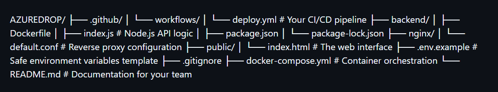

# ☁️ AzureDrop (CloudDrop)

AzureDrop is a production-grade, 3-tier containerized file management system. It provides a secure web interface for users to upload, view, and manage files. The application leverages a Node.js backend to process uploads, stores relational metadata in a PostgreSQL database, and streams large binary files directly to AWS S3. 

Built with scalability and security as primary focuses, the entire stack is containerized using Docker and deployed to an AWS EC2 instance via a fully automated GitHub Actions CI/CD pipeline.

## ✨ Key Features

* **Keyless Cloud Authentication:** Utilizes AWS IAM Instance Profiles to securely access S3 buckets without hardcoding AWS access keys or secrets in the codebase.
* **Fully Containerized:** The frontend proxy, API backend, and database are completely isolated in Docker containers, ensuring environment parity between local development and production.
* **Automated CI/CD:** Every push to the `main` branch triggers a GitHub Actions workflow that securely SSHs into the EC2 instance, pulls the latest code, and rebuilds the containers with zero downtime.
* **Efficient Memory Management:** Uses Multer memory storage and Node.js streams to handle file payloads, configured alongside Nginx client body limits to prevent server memory exhaustion.

## 🏗️ System & Infrastructure Architecture

```text
[ Client Browser ]
       │
       ▼ (HTTP / Port 80)
┌─────────────────────────────────────────────────────────────┐
│                        AWS Cloud                            │
│                                                             │
│  ┌───────────────────────────────────────────────────────┐  │
│  │                   AWS EC2 Instance                    │  │
│  │                 (Ubuntu / us-east-1)                  │  │
│  │                                                       │  │
│  │  [ IAM Instance Profile: Keyless S3 Access ]          │  │
│  │                                                       │  │
│  │  ┌─────────────────────────────────────────────────┐  │  │
│  │  │             Docker & Docker Compose             │  │  │
│  │  │                                                 │  │  │
│  │  │  ┌───────────────┐           ┌───────────────┐  │  │  │
│  │  │  │     Nginx     │ ◄───────► │    Node.js    │  │  │  │
│  │  │  │  (Container)  │           │  (Container)  │  │  │  │
│  │  │  └───────┬───────┘           └───────┬───────┘  │  │  │
│  │  │          │                           │          │  │  │
│  │  │          ▼                           ▼          │  │  │
│  │  │   [ public/ui ]              ┌───────────────┐  │  │  │
│  │  │                              │  PostgreSQL   │  │  │  │
│  │  │                              │  (Container)  │  │  │  │
│  │  │                              └───────────────┘  │  │  │
│  │  └─────────────────────────────────────────────────┘  │  │
│  └──────────────────────────┬────────────────────────────┘  │
│                             │                               │
│                             ▼ (Direct AWS SDK Stream)       │
│  ┌───────────────────────────────────────────────────────┐  │
│  │                    AWS S3 Bucket                      │  │
│  │               (louddrop-files-9912)                   │  │
│  └───────────────────────────────────────────────────────┘  │
└─────────────────────────────────────────────────────────────┘
       ▲
       │ (Automated SSH Deployment)
[ GitHub Actions CI/CD Pipeline ]
'''
